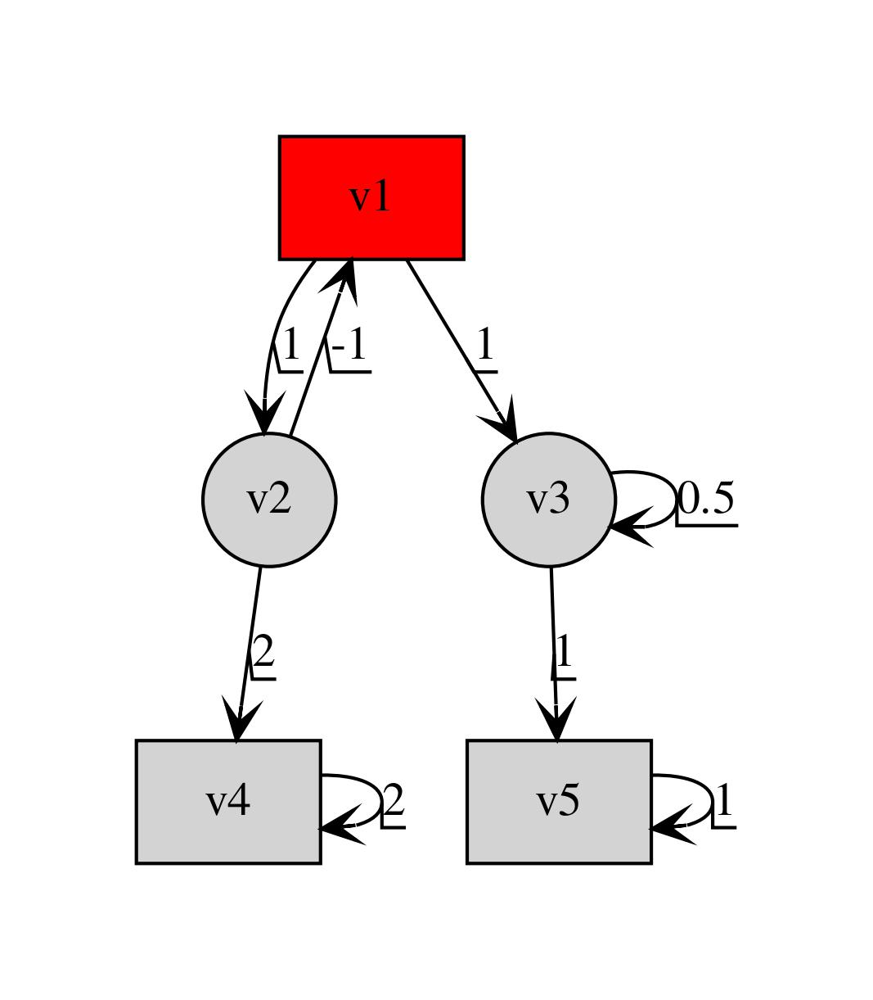
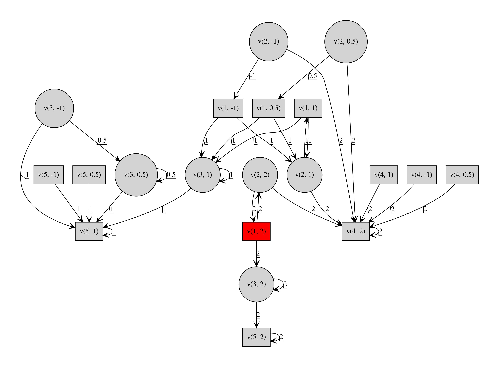

# Description

This code is the implementation of the first variant of the regret strategy for Eve(controller) when Adam(env) can play any strategy.

# Instructions to run the code

1. **Installing the env**\
Install anaconda on your os and then run the below moentioned shell commands with conda path

2. Install dependencies - Install conda env

    Use the terminal or an Anaconda Prompt for the following steps:

* Create the environment from the environment.yaml file under conda

    ```conda env create -f variant_1.yml```

* The first line of the yml file sets the new environment's name. In my case it is "". you could modify it before compiling this file.

*  Verify that the new environment was installed correctly. You should see a star('\*') in front of the current active env

    ```conda env list```

    you can also use

    ```conda info --envs```
		
# Running the code 

# Strategy synthesis for eve when Adam can play any strategy

# Result

<!--  -->
<p align="center">

</p>

---
<p align="center">
<!--  -->

</p>

---
<p align="center">
<!--  -->

</p>

---
<p align="center">
<!--  -->

</p>

---


# References

`Hunter, Paul, Guillermo A. Pérez, and Jean-François Raskin. "Reactive synthesis without regret." arXiv preprint arXiv:1504.01708 (2015).`

