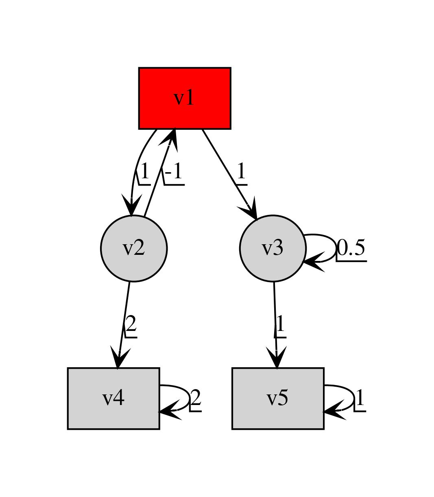
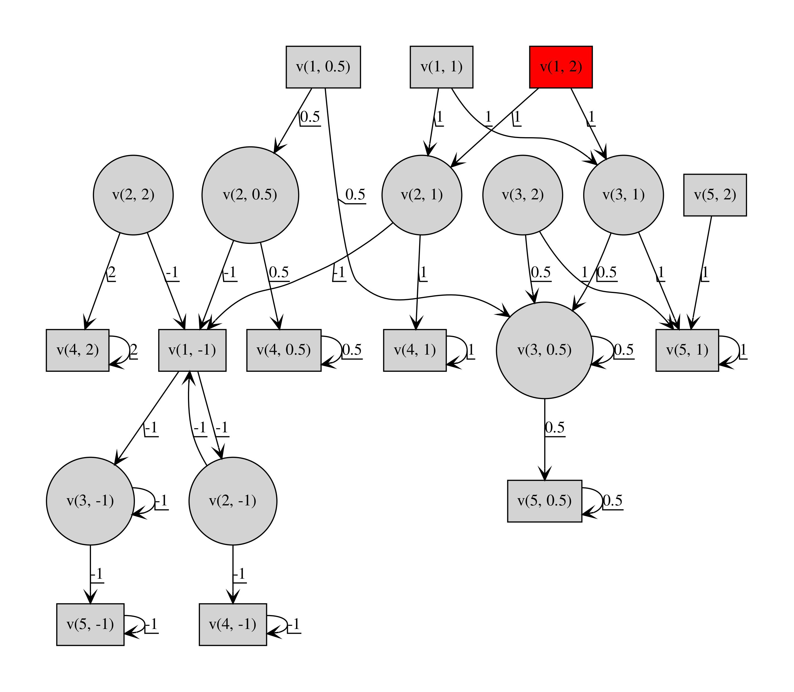
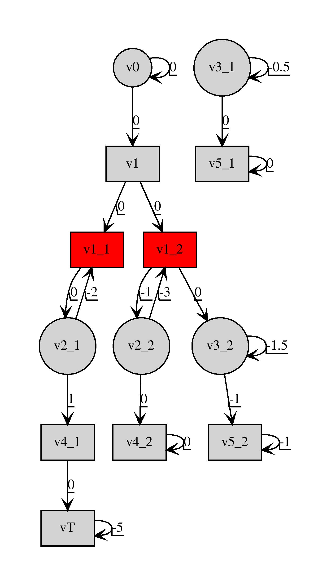

# Description

This code is the implementation of the first variant of the regret strategy for Eve(controller) when Adam(env) can play any strategy.

# Instructions to run the code

1. **Installing the env**\
Install anaconda on your os and then run the below moentioned shell commands with conda path

2. Install dependencies - Install conda env

    Use the terminal or an Anaconda Prompt for the following steps:

* Create the environment from the environment.yaml file under conda

    ```conda env create -f variant_1.yml```

* The first line of the yml file sets the new environment's name. In my case it is `adam_can_play_any_strategy`. You could modify it before compiling this file.

*  Verify that the new environment was installed correctly. You should see a star('\*') in front of the current active env

    ```conda env list```

    you can also use

    ```conda info --envs```

* If you don't see a ('\*') in front of the newly created env, but can see it in the env list then activate the env

	```conda activate adam_can_play_any_strategy```

# Project Hierarchy and Implementation

1. main.py : The main module that contains the code relevant to regret minimization strategy syntheis using Variant 1 Pseudocode. The Pseucode can be found [here](https://github.com/MuvvalaKaran/Adam-Can-Play-Any-Strategy/blob/add_feature_product_grpah_pruning/pseudo_code/Variant_I_Pseudocode.pdf).

	* The main() method implements the regret minimization pseudocode and calls the following functions. 

		- construct_graph() : A method to call the factory class GraphFactory() to construct a two player game `G` with nodes that bleong to `Eve`(the system/ controller player) and `Adam`(the env/human player). Each edge `e` is initialized with an edge weight given by the weight function `w(e)`. 
		
		- construct_w_prime() : A method implementing Algorithm 2 of the Pseudocode. This method computes `W'` - a set of cooperative values( `cVal`) for each edge `e = (u, v)` that belong to `G` such that if `Eve` plays an alternate startegy (i.e playing any other edge `e = (u, v')`) then `Adam` plays cooperatively in this alternative strategy played by `Eve`. So `Adam` is trying to maximize `Eve's` payoff for the alternate strategies.
		
		- construct_g_hat() : A method implementing Algorithm 3 of the Pseudocode. This method construct the antagonistic game `G_hat` which is composed of `G_b`(s) where `b` is the value that belongs to the set `W'`. The new weight function `w_hat(.)` is given by `w(e) - b` for `G_b` in `G_hat`.
		
		- compute_aVal() : A method to compute the antagonistic value for the game `G_hat` following Algorithm 4 of the Pseudocode. Regret for the game `G` is equivalent to `-aVal(G_hat)`. This function also returns the memoryless strategy followed by `Eve` and `Adam` on `G_hat`.

		- map_g_hat_to_org_graph() : A helper method to map back the original strategy for `Eve` and `Adam` from `G_hat` to `G`.

2. src/compute_payoff :  A module implementing the class payoff_value used to quantify the value of all the possible infinte loops in a given game with a given initial node. 

3. src/graph/graph.py : A module implementing the abstract base Graph class. This class implements the foundational member function like creating a Multi-Directed Graph from the networkx package, methods to add states, edges, and states and edges with attributes along with method to dump a Graph in a yaml file and read and plot it using graphviz. Below are the child classes :
	
	1. TwoPlayerGraph : A class that implements the construction of a two player graph. We can use this class to directly construct a two player game and feed it to the regret minimization strategy synthesis code in main() module to compute the least regret strategies for `Eve`. Else we can construct the product graph (P) using the `ProductAutomaton` class that takes as input a Transition system(T) and an Automaton (in our case a Deterministic Finite Automaton(DFA) - A) and takes the product of these two. 
	
	2. DFAGraph(A) : A class that implements the construction of a Buchi Automaton(BA) . This BA is the output [spot](https://spot.lrde.epita.fr/) toolbox which takes in as input a LTL formula(in our case it is a co-safe LTL formula) and output is a BA in NeverClaim format. This output is interpreted using the src/graph/promela.py module. 
	
	The child classes of TwoPlayerGraph are :

	1. GminGraph : A class that implements the construction of a gmin graph for `inf` payoff function following the theory in the paper.

	2. GmaxGraph : A class that implements the construction of a gmax graph for `sup` payoff function following the theory in the paper
	
	3. FiniteTransSys(T) : A class that implements the construction of a Finite Transition system graph. There are some option methods in this class that helps build a two player transition system custom to our application and then prune edges that belong to `Eve` that do not eventually lead to the accepting states.  
	
	4. ProductAutomaton(P) : A class that automates the construction of a two player graph given T and A. 


4. src/graph/spot.py : A module that implements methods to run spot through a shell and interpret the raw output using an ascii decoder. 

# Running the code 

# Result

<!--  -->
<p align="center">

</p>

---
<p align="center">
<!--  -->

</p>

---
<p align="center">
<!--  -->

</p>

---
<p align="center">
<!--  -->

</p>

---


# References

`Hunter, Paul, Guillermo A. Pérez, and Jean-François Raskin. "Reactive synthesis without regret." arXiv preprint arXiv:1504.01708 (2015).`

